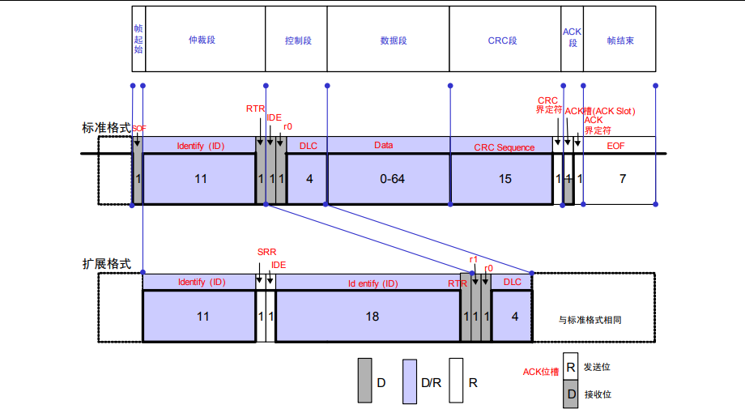
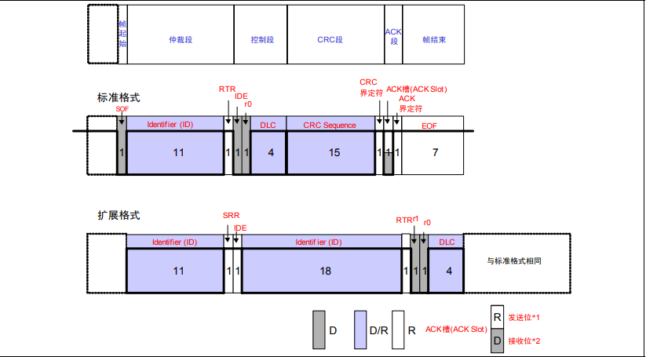
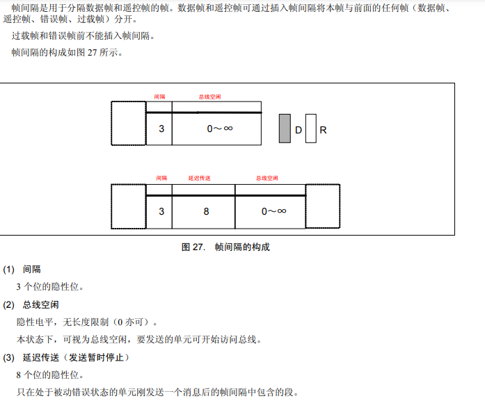
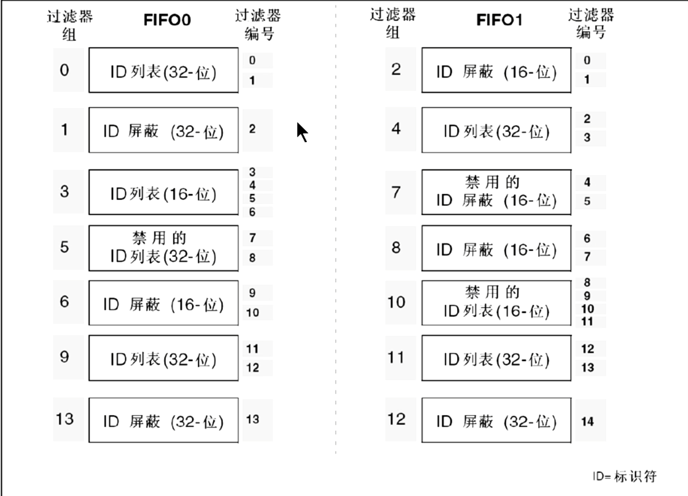

# CAN
## 综述
- 使用专用的CAN总线端口，STM32F1xx上为`PA11=>RX`，`PA12=>TX`
- 芯片内部集成CAN总线控制器，但是电平转换需要借助外设，常用TJA1050(5V)(ISO 11898)
- 两线制，分H线和L线
- 类似RS485，一般采用双绞线，两端分别接入120Ω的匹配电阻减少回波反射，通信距离10km
- 挂载总线APB1
### 波特率设置
$$
BaudRate = \frac{pclk1}{(1+8+7)\times 9}
$$
在STM32F1xx上波特率设置为250kBaud

---

## 电平规定
- 使用(H-L)电位差判断电平
- 显性电平具有优先权，只要有一个设备输出显性电平，则总线上即为显性电平；只有所有单元都输出隐性电平时总线才为隐性电平
- 随着通信长度的增加，通信速度下降
### **ISO 11898(High Speed, 125kbps~1Mbps)**
|隐性，逻辑1|显性逻辑0|
|--|--|
|电位差-0.5~+0.05V，典型值0V|电位差1.5V~3.0V，典型值2V|
|||
- 两线之间需要跨接120Ω电阻提高稳定性
- 最大连接单元数30
- 总线最大长度40m
### **ISO 11519-2(Low Speed, <125kbps)**
|隐性，逻辑1|显性逻辑0|
|--|--|
|典型值-1.5V|典型值3V|
|||
- 总线最大长度1km
- 最大连接单元数20

---

## 帧种类

### 数据帧
- 用于发送单元向接收单元传送数据  
*D代表显性电平，R代表隐性电平*


数据帧由 7 个段构成。 
1. **帧起始**
   1. 表示数据帧开始的段
   2. 1位显性位
2. **仲裁段**
   1. 表示该帧优先级的段，存放ID
   2. 标准格式：ID11位+RTR，占据ID28~ID18，禁止高7位都为隐性
   3. 扩展格式：ID29位，ID28~ID18+SRR+IDE+ID17~ID0+RTR，禁止高7位隐性
3. **控制段**
   1. 表示数据的字节数及保留位的段。
   2. DLC用4位二进制数表示发送数据的长度，单位**字节**，范围为0~8B即0~64bit
4. **数据段**
   1. 数据的内容，可发送 0～8 个字节的数据。
   2. 高位在前低位在后
5. **CRC 段**
   1. 检查帧的传输错误的段。
   2. 15位CRC+1位隐形界定(分隔)符
6. **ACK 段**
   1. 表示确认正常接收的段。
   2. 发送单元发送两位隐性位
   3. 接受单元接收正确发送显性+隐性；接受错误则两个隐性
7. **帧结束**
   1. 表示数据帧结束的段。
   2. 7位隐性位


### 遥控帧（远程帧）
- 用于接收单元向具有相同ID的发送单元请求数据的帧



遥控帧由 7 个段构成。 
1. **帧起始**
   1. 表示数据帧开始的段
   2. 1位显性位
2. **仲裁段**
   1. 表示该帧优先级的段，存放ID
   2. 标准格式：ID11位+RTR，占据ID28~ID18，禁止高7位都为隐性
   3. 扩展格式：ID29位，ID28~ID18+SRR+IDE+ID17~ID0+RTR，禁止高7位隐性
   4. 注意RTR为隐性位，与数据帧不同
3. **控制段**
   1. DLC用4位二进制数表示请求发送数据的长度，单位**字节**，范围为0~8B即0~64bit
4. **CRC 段**
   1. 检查帧的传输错误的段。
   2. 15位CRC+1位隐形界定(分隔)符
5. **ACK 段**
   1. 表示确认正常接收的段。
   2. 发送单元发送两位隐性位
   3. 接受单元接收正确发送显性+隐性；接受错误则两个隐性
6. **帧结束**
   1. 表示数据帧结束的段。
   2. 7位隐性位

### 错误帧
### 过载帧
### 帧间隔


---

### 优先级的决定
多个单元同时开始发送时，各发送单元从仲裁段的第一位开始进行仲裁。连续输出显性电平最多的单元可继
续发送。
- 数据帧仲裁段RTR位显性，相比遥控帧具有优先权 
- 标准格式 ID 与具有相同 ID 的遥控帧或者扩展格式的数据帧在总线上竞争时，标准格式的 RTR 位为显性位
的具有优先权，可继续发送。

### 位填充
#### 发送单元的工作
在发送数据帧和遥控帧时，SOF～CRC 段间的数据，相同电平如果持续 5 位，在下一个位（第 6 个位）则
要插入 1 位与前 5 位反型的电平。
#### 接收单元的工作
在接收数据帧和遥控帧时，SOF～CRC 段间的数据，相同电平如果持续 5 位，需要删除下一个位（第 6 个
位）再接收。如果这个第 6 个位的电平与前 5 位相同，将被视为错误并发送错误帧。

---

## CAN在STM32F1上的使用
### 发送
1. 使能时钟`RCC_APB1PeriphClockCmd(RCC_APB1Periph_CAN1, ENABLE);`
2. 声明`GPIO_InitTypeDef`结构初始化，端口模式设置为**上拉输入**模式
3. 声明`CAN_InitTypeDef`结构并填充初始数据，调用`CAN_Init(CAN_InitTypeDef* CAN_InitStruct)`完成初始化
4. 声明`CAN_FilterInitTypeDef`结构并填充初始数据，调用`CAN_FilterInit(CAN_FilterInitTypeDef* CAN_FilterInitSturct)`完成过滤器初始化
5. 声明`CANTxMsg`结构，调用`mailbox = CAN_Transmit(CanTxMsg* TxMessage)` 函数发送数据，返回值对应用来传输的邮箱(u8)
6. 为了避免发送数据时卡死，需要加入判断函数
   ```C
    u8 i=0;
    while((CAN_TransmitStatus(CAN1,mbox)==CAN_TxStatus_Failed)&&(i<0XFFF))i++; //等待发送结束
    if(i>=0XFFF)return OK;
    return FAILED;
   ```

#### 发送邮箱
发送部分拥有三个邮箱1，2，3，优先级依次降低。优先级高则先发送。待发送的数据将被送入空闲邮箱中优先级最高的一个。

---

#### **初始化——CAN_InitTypeDef结构**
```C
typedef struct{
   FunctionnalState CAN_TTCM;
   FunctionnalState CAN_ABOM;
   FunctionnalState CAN_AWUM;
   FunctionnalState CAN_NART;
   FunctionnalState CAN_RFLM;
   FunctionnalState CAN_TXFP;
   u8 CAN_Mode;
   u8 CAN_SJW;
   u8 CAN_BS1;
   u8 CAN_BS2;
   u16 CAN_Prescaler;
} CAN_InitTypeDef;
```
##### **CAN_TTCM**
CAN_TTCM 用来使能或者失能时间触发通讯模式，可以设置这个参数的值为 ENABLE 或者 *DISABLE*。

##### **CAN_ABOM**
CAN_ABOM 用来使能或者失能自动离线管理，可以设置这个参数的值为 ENABLE 或者 *DISABLE*。

##### **CAN_AWUM**
CAN_AWUM 用来使能或者失能自动唤醒模式，可以设置这个参数的值为 ENABLE 或者 *DISABLE*。

##### **CAN_NART**
CAN_NARM 用来使能或者失能非自动重传输模式，可以设置这个参数的值为 *ENABLE* 或者 DISABLE。

##### **CAN_RFLM**
CAN_RFLM 用来使能或者失能接收 FIFO 锁定模式，可以设置这个参数的值为 ENABLE 或者 *DISABLE*。

##### **CAN_TXFP**
CAN_TXFP 用来使能或者失能发送 FIFO 优先级，可以设置这个参数的值为 ENABLE 或者 *DISABLE*。

##### **CAN_Mode**
CAN_Mode 设置了 CAN 的工作模式
|CAN_Mode |描述|
|--|--|
|*CAN_Mode_Normal* |*CAN 硬件工作在正常模式*|
|CAN_Mode_Silent|CAN 硬件工作在静默模式|
|CAN_Mode_LoopBack|CAN 硬件工作在环回模式|
|CAN_Mode_Silent_LoopBack|CAN 硬件工作在静默环回模式|

##### **波特率设置：CAN_SJW, CAN_BS1, CAN_BS2, CAN_Prescaler**
实际上就是设置$BaudRate = \frac{pclk1}{(1+8+7)\times 9}$中的系数1，8，7，9
```C
CAN_InitStructure.CAN_SJW=CAN_SJW_1tq;             //重新同步跳跃宽度(Tsjw)为tsjw+1个时间单位  CAN_SJW_1tq    CAN_SJW_2tq CAN_SJW_3tq CAN_SJW_4tq
    CAN_InitStructure.CAN_BS1=CAN_BS1_8tq;             //Tbs1=tbs1+1个时间单位CAN_BS1_1tq ~ CAN_BS1_16tq
    CAN_InitStructure.CAN_BS2=CAN_BS2_7tq;             //Tbs2=tbs2+1个时间单位CAN_BS2_1tq ~ CAN_BS2_8tq
    CAN_InitStructure.CAN_Prescaler=9;        //分频系数(Fdiv)为brp+1
```

---

#### 过滤器管理——CAN_FilterInitTypeDef结构
```C
typedef struct
{
    u8 CAN_FilterNumber;
    u8 CAN_FilterMode;
    u8 CAN_FilterScale;
    u16 CAN_FilterIdHigh;
    u16 CAN_FilterIdLow;
    u16 CAN_FilterMaskIdHigh;
    u16 CAN_FilterMaskIdLow;
    u16 CAN_FilterFIFOAssignment;
    FunctionalState CAN_FilterActivation;
} CAN_FilterInitTypeDef; 
```
##### **CAN_FilterNumber**
CAN_FilterNumber 指定了待初始化的过滤器，它的范围是 1 到 13。
##### **CAN_FilterMode**
CAN_FilterMode 指定了过滤器将被初始化到的模式
|CAN_FilterMode| 描述|
|--|--|
|CAN_FilterMode_IdMask |标识符屏蔽位模式|
|CAN_FilterMode_IdList |标识符列表模式|
##### **CAN_FilterScale**
CAN_FilterScale 给出了过滤器位宽
|CAN_FilterScale| 描述|
|--|--|
|CAN_FilterScale_Two16bit| 2 个 16 位过滤器|
|*CAN_FilterScale_One32bit*| *1 个 32 位过滤器*|
##### **CAN_FilterIdHigh**
CAN_FilterIdHigh 用来设定过滤器标识符（32 位位宽时为其高段位，16 位位宽时为第一个）。它的范围是
0x0000 到 0xFFFF。
##### **CAN_FilterIdLow**
CAN_FilterIdHigh 用来设定过滤器标识符（32 位位宽时为其低段位，16 位位宽时为第二个）。它的范围是
0x0000 到 0xFFFF。
##### **CAN_FilterMaskIdHigh**
CAN_FilterMaskIdHigh 用来设定过滤器屏蔽标识符或者过滤器标识符（32 位位宽时为其高段位，16 位位宽时为第一个）。它的范围是 0x0000 到 0xFFFF。
##### **CAN_FilterMaskIdLow**
CAN_FilterMaskIdLow 用来设定过滤器屏蔽标识符或者过滤器标识符（32 位位宽时为其低段位，16 位位
宽时为第二个）。它的范围是 0x0000 到 0xFFFF。
##### **CAN_FilterFIFO**
CAN_FilterFIFO 设定了指向过滤器的 FIFO（0 或 1）
|CAN_FilterFIFO| 描述|
|--|--|
|CAN_FilterFIFO0| 过滤器 FIFO0 指向过滤器 x|
|CAN_FilterFIFO1| 过滤器 FIFO1 指向过滤器 x|
##### **CAN_FilterActivation**
CAN_FilterActivation使能或者失能过滤器。该参数可取的值为 *ENABLE* 或者 DISABLE。

---

#### **帧结构管理——CanTxMsg结构**
```C
typedef struct{
    uint32_t StdId; //标准帧 ID，如果您要发送扩展帧。可以不管它
    uint32_t ExtId; //扩展帧 ID，如果您要发送标准帧。可以不管它
    uint8_t IDE; //您是想发送标准帧还是扩展帧？
    uint8_t RTR; //您是想发送数据帧还是远程帧？
    uint8_t DLC; // 您想发送数据的长度。
    uint8_t Data[8]; //您想要发送的数据。
} CanTxMsg;
```
##### **StdId**
StdId 用来设定标准标识符。它的取值范围为 0 到 0x7FF。
##### **ExtId**
ExtId 用来设定扩展标识符。它的取值范围为 0 到 0x1FFFFFFF。
##### **IDE**
IDE 用来设定消息标识符的类型。
|IDE|描述|
|--|--|
|CAN_Id_Standard|使用标准标识符|
|CAN_Id_Extended|使用扩展标识符|

##### **RTR**
RTR 用来设定待传输消息的帧类型。它可以设置为数据帧或者远程帧。
|RTR|描述|
|--|--|
|CAN_RTR_Data|数据帧|
|CAN_RTR_Remote|远程帧|
##### **DLC**
DLC 用来设定待传输消息的帧长度，单位字节。它的取值范围是 0 到 0x08。
##### **Data[8]**
Data[8]包含了待传输数据，它的取值范围为 0 到 0xFF。

---

### 接收
1. 声明结构体`CanRxMsg`
2. 将该空结构体作为参数调用`CAN_Receive(CAN_TypeDef* CANx, uint8_t FIFONumber, CanRxMsg* RxMessage)`即可在结构体中获得接收的数据帧，`FIFONumber`可为`CANFIFO0`或者`CANFIFO1`
3. 数据存放在`RxMessage.Data[8]`中

----

#### 过滤
- 共14个过滤器组，每一组包含**两个32位寄存器**`CAN_FxR1`和`CAN_FxR2`

**标识符屏蔽模式**
- `CAN_FxR1`存放ID
- `CAN_FxR2`存放屏蔽
- 接收到的ID与“屏蔽中为1的位对应ID位”必须相同才能通过过滤器

**标识符列表模式**
- `CAN_FxR1`和`CAN_FxR2`均存放ID，接收到的ID必须与这两个ID中的一个相同才能通过过滤器

- 不同的过滤器模式设置会产生不同的过滤器编号，过滤器编号将会被送入FIFO寄存器中，这样便可得知当前邮箱中收到的数据是来自哪一个过滤器



##### 过滤器优先级
- 32位过滤器优先于16位
- 位宽相同，标识符列表优先于标识符屏蔽
- 位宽和模式相同，取决于过滤器自身编号

---

#### 接收邮箱FIFO
- 位于过滤器后面，只有通过过滤器的报文才能进入邮箱
- STM32F103有两个FIFO邮箱，每个深度有3层


---

#### 接收数据管理——CanRxMsg结构
```C
typedef struct{
   u32 StdId;
   u32 ExtId;
   u8 IDE;
   u8 RTR;
   u8 DLC; //接收到的数据长度
   u8 Data[8]; //接收到的数据
   u8 FMI;
} CanRxMsg; 
```