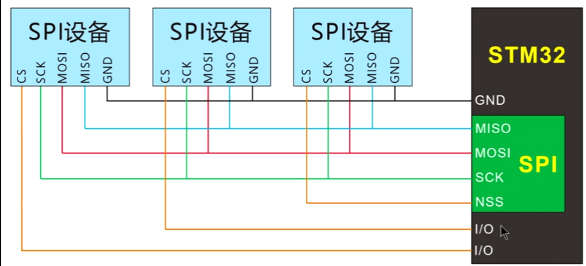

# SPI
## STM32F1xx SPI综述
- 2个SPI接口
- 全双工/半双工
- 速率可达18Mbps
- 支持DMA
- 用3个预分频器来设置8种工作频率
- SPI2挂载于总线APB1，SPI1挂载于总线APB2

### 接口分配


- `MISO` 主机输入/从机输出
- `MOSI` 主机输出/从机输入
- `SCK` 时钟线
- `CS/NSS` 片选信号，单片机上只有一个片选信号，故需要借助其他的IO口完成片选

## 协议分析
- SCLK信号线只由主设备控制，从设备不能控制信号线。两根信号线上的数据在时钟上升沿或者下降沿时进行采样。
- **外设的写操作和读操作是同步完成的**。主机与从机都有移位寄存器，主机通过MOSI线将寄存器的内容发送至从机的寄存器，同时从机也将其移位寄存器的内容通过MISO线送入主机的寄存器，两个寄存器的内容交换。**如果要只读，则主机需要发送空字节引发从机传输；如果只写则主机忽略收到的数据。**
- **为什么发送和接收会同步进行？** SPI总线相当于环形结构，主机发送高位数据后，进入从机寄存器的低位，从机寄存器的高位被“挤出来”送到主机寄存器的低位。整个过程可看作循环移位操作。为保证上述过程正确进行，主从机必须设置为相同的通讯模式！

### 数据帧格式
- 数据帧格式(8位或16位)由`SPI_CR1`寄存器的`DFF`位选择，并且决定发送/接收的数据长度
- 根据`SPI_CR1`寄存器中的`LSBFIRST`位，输出数据位时可以MSB在先也可以LSB在先。
- 通过修改`SPI_CR1`寄存器中的`CPOL`和`CPHA`标志位修改空闲电平和数据采样周期

### 通讯模式
通过修改`SPI_CR1`寄存器中的`CPOL`和`CPHA`标志位控制通讯模式
|模式|CPOL(时钟极性)|CPHA(时钟相位)|意义|
|--|--|--|--|
|MODE0|0|0|空闲时为低电平，上升沿采样|
|MODE1|0|1|空闲时为低电平，下降沿采样|
|MODE2|1|0|空闲时为高电平，下降沿采样|
|MODE3|1|1|空闲时为低电平，上升沿采样|

1. **在改变CPOL/CPHA位之前，必须清除SPE位将SPI禁止**。
2. 主和从必须配置成相同的时序模式。
3. SCK的空闲状态必须和SPI_CR1寄存器指定的极性一致(CPOL为’1’时，空闲时应上拉SCK为
高电平；CPOL为’0’时，空闲时应下拉SCK为低电平)。

## STM32F1xx固件库开发
1. 开启总线SPI时钟`RCC_APB1PeriphClockCmd(RCC_APB1Periph_SPI2, ENABLE)`或者`RCC_APB2PeriphClockCmd(RCC_APB2Periph_SPI1, ENABLE)`；开启总线GPIOx时钟`RCC_APB1PeriphClockCmd(RCC_APB1Periph_GPIOx, ENABLE)`。
2. 声明`GPIO_InitTypeDef GPIO_InitSturcture`结构体并对四个引脚进行初始化，调用`GPIO_Init(GPIO_Port, GPIO_InitStructure)`写入设置
   1. MISO引脚设置为浮空输入
   2. MOSI引脚设置为复用推挽输出
   3. SCK引脚设置为复用推挽输出
   4. 软件控制片选信号时NSS设置为推挽输出，若要硬件则设置为复用推挽输出，或许可以一劳永逸直接复用推挽
3. 声明`SPI_InitTypeDef SPI_InitStructure`结构体并初始化
4. 调用`SPI_Init(SPIx, SPI_InitStructure)`写入SPI设置
5. 调用`SPI_Cmd(SPIx, ENABLE)`使能SPI

### **初始化结构体SPI_InitTypeDef**
```C
typedef struct{
    u16 SPI_Direction;
    u16 SPI_Mode;
    u16 SPI_DataSize;
    u16 SPI_CPOL;
    u16 SPI_CPHA;
    u16 SPI_NSS;
    u16 SPI_BaudRatePrescaler;
    u16 SPI_FirstBit;
    u16 SPI_CRCPolynomial;
} SPI_InitTypeDef;
```

#### **SPI_Direction**
SPI_Dirention 设置了 SPI 单向或者双向的数据模式。
|SPI_Mode| 描述|
|--|--|
|*SPI_Direction_2Lines_FullDuplex*| SPI 设置为双线双向全双工|
|SPI_Direction_2Lines_RxOnly| SPI 设置为双线单向接收|
|SPI_Direction_1Line_Rx SPI| 设置为单线双向接收|
|SPI_Direction_1Line_Tx SPI| 设置为单线双向发送|

#### **SPI_Mode**
SPI_Mode 设置了 SPI 工作模式。
|SPI_Mode| 描述|
|--|--|
|*SPI_Mode_Master*| 设置为主 SPI|
|SPI_Mode_Slave| 设置为从 SPI|

#### **SPI_DataSize**
SPI_DataSize 设置了 SPI 的数据大小。
|SPI_DataSize |描述|
|--|--|
|SPI_DataSize_16b |SPI 发送接收 16 位帧结构|
|*SPI_DataSize_8b* |SPI 发送接收 8 位帧结构|

#### **SPI_CPOL**
SPI_CPOL 选择了串行时钟的稳态。
|SPI_CPOL |描述|
|--|--|
|*SPI_CPOL_High* |时钟悬空高|
|SPI_CPOL_Low |时钟悬空低|

#### **SPI_CPHA**
SPI_CPHA 设置了位捕获的时钟活动沿。
|SPI_CPHA 描述|
|--|--|
|*SPI_CPHA_2Edge*| 数据捕获于第二个时钟沿|
|SPI_CPHA_1Edge| 数据捕获于第一个时钟沿|

#### **SPI_NSS**
SPI_NSS 指定了 NSS 信号由硬件（NSS 管脚）还是软件（使用 SSI 位）管理。
|SPI_NSS |描述|
|SPI_NSS_Hard NSS |由外部管脚管理|
|*SPI_NSS_Soft* |内部 NSS 信号有 SSI 位控制（软件控制片选）|

#### **SPI_BaudRatePrescaler**
SPI_BaudRatePrescaler 用来定义波特率预分频的值，这个值用以设置发送和接收的 SCK 时钟。
|SPI_NSS| 描述|
|--|--|
|SPI_BaudRatePrescaler2 |波特率预分频值为 2|
|SPI_BaudRatePrescaler4 |波特率预分频值为 4|
|SPI_BaudRatePrescaler8 |波特率预分频值为 8|
|SPI_BaudRatePrescaler16 |波特率预分频值为 16|
|SPI_BaudRatePrescaler32 |波特率预分频值为 32|
|SPI_BaudRatePrescaler64 |波特率预分频值为 64|
|SPI_BaudRatePrescaler128 |波特率预分频值为 128|
|*SPI_BaudRatePrescaler256* |波特率预分频值为 256|
注意：通讯时钟由主 SPI 的时钟分频而得，不需要设置从 SPI 的时钟。

#### **SPI_FirstBit**
SPI_FirstBit 指定了数据传输从 MSB 位还是 LSB 位开始。
|SPI_FirstBit |描述|
|--|--|
|*SPI_FisrtBit_MSB* |数据传输从 MSB 位开始|
|SPI_FisrtBit_LSB |数据传输从 LSB 位开始|

#### **SPI_CRCPolynomial**
SPI_CRCPolynomial 定义了用于 CRC 值计算的多项式。*示例程序用了 `7` 这个值。*

### 数据发送和接收
函数原型：`void SPI_SendData(SPI_TypeDef *SPIx, u16 Data)`与`u16 SPI_ReceiveData(SPI_TypdeDef SPIx)`

#### **I2S模式**
- 飞利浦开发的用于音频数据传输的 *集成电路内置音频总线* 协议，看起来网上的教程全部用的都是这种方式的SPI(?)
```C
u16 SPIx_SendAndReceive(u16 SendData){//数据大小取决于初始化时选择的帧格式
	while(SPI_I2S_GetFlagStatus(SPIx,SPI_I2S_FLAG_TXE) == RESET); //如果发送寄存器数据没有发送完，循环等待
	SPI_I2S_SendData(SPIx,SendData);  //往发送寄存器写入要发送的数据
    while(SPI_I2S_GetFlagStatus(SPIx, SPI_I2S_FLAG_RXNE) == RESET);
    SPI_I2S_ReceiveData(SPIx);
}
```

```C
u16 SPIx_SendAndReceive(u16 SendData){//数据大小取决于初始化时选择的帧格式
	while(SPI_GetFlagStatus(SPIx,SPI_FLAG_TXE) == RESET); //如果发送寄存器数据没有发送完，循环等待
	SPI_SendData(SPIx,SendData);  //往发送寄存器写入要发送的数据
    while(SPI_GetFlagStatus(SPIx, SPI_FLAG_RXNE) == RESET);
    SPI_ReceiveData(SPIx);
}
```
### 常用标志位
|名称||
|--|--|
|SPI_FLAG_BSY|总线忙|
|SPI_FLAG_TXE|发送寄存器空|
|SPI_FLAG_RXNE|接收寄存器非空|