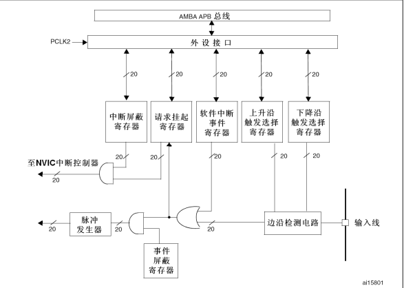
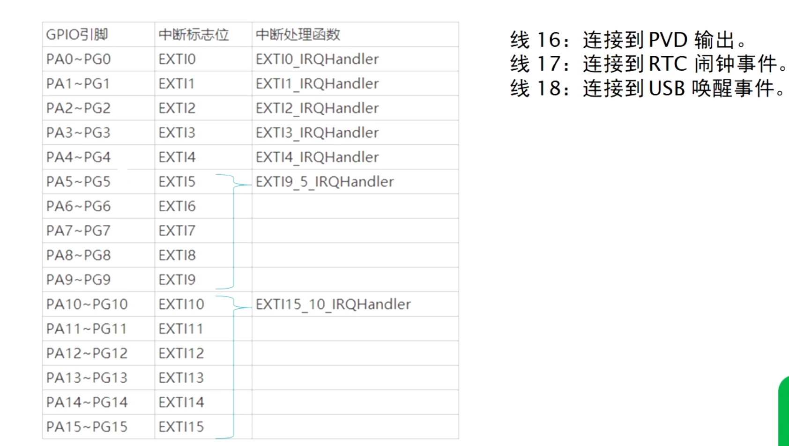

# 中断

## NVIC
### 抢占优先级与响应优先级
- 抢占优先级高的中断可以打断抢占优先级低的中断
- 抢占优先级相同，高响应优先级**不能**打断低响应优先级
- 抢占优先级相同，两个中断同时发生时响应优先级高的优先执行
- 两个中断的抢占和响应优先级相同，则哪个先发生就哪个先执行
- 优先级数越小优先级越高

### NVIC中断优先级分组
- 优先级的分组在寄存器`SCB->AIRCR`的[10:8]中设置( `NVIC_PriorityGruopConfig(uint32_t NVIC_PriorityGroup_x)` )；抢占优先级与响应优先级的值在IP寄存器的[7:4]位中存放
- IP寄存器一共240个，与CM3内核可编程中断一一对应，STM32没有全部使用，但是依旧保留240个；每个IP寄存器为8位，4个组成32位，高四位有效，低四位不使用

|优先级分组|AIRCR[10:8]|IP[7:4]中抢占优先级：响应优先级|
|--|--|--|
|NVIC_PriorityGroup_0|111|0:4|
|NVIC_PriorityGroup_1|110|1:3|
|NVIC_PriorityGroup_2|101|2:2|
|NVIC_PriorityGroup_3|100|3:1|
|NVIC_PriorityGroup_4|011|4:0|

- 一般情况下，系统代码执行过程中只设置一次中断优先级分组，随意改变会导致中断管理混乱

### 中断优先级设置
#### NVIC_InitTypeDef
```C
typedef struct{
    uint8_t NVIC_IRQChannel;    // 设置中断通道
    uint8_t NVIC_IRQChannelPreemptionPriority;  // 设置响应优先级
    uint8_t NVIC_IRQChannelSubPriority; //设置抢占优先级
    FunctionState NVIC_IRQChannelCmd;   // 使能、失能
}NVIC_InitTypeDef;
```

初始化代码示例（以串口1为例）：
```C
NVIC_PriorityGruopConfig(uint32_t NVIC_PriorityGroup_2);    // 设置优先级分组为2

NVIC_InitTypeDef NVIC_InitStructure;
NVIC_InitStructure.NVIC_IRQChannel = USART1_IRQn;   // 设置通道为串口1
NVIC_InitStructure.NVIC_IRQChannelPreemptionPriority = 1;    // 抢占优先级设置为1
NVIC_InitStructure.NVIC_IRQCHannelSubPriority = 2;  // 响应优先级设置为2
NVIC_InitStructure,NVIC_IRQChannelCmd = ENABLE; // 中断使能
NVIC_Init(&NVIC_InitStructure);
```

#### 清除中断挂起
```C
NVIC_ClearPendingIRQ(USART1_IRQn)
```

### 部分寄存器
#### 中断使能/除能寄存器
- `NVIC->ISER`与`NVIC->ICER`，共240对，2*8个32位寄存器
- 使能中断则写1到ISER对应位，除能中断写1到ICER对应位，写0无效

#### 中断挂起和清除寄存器
- `NVIC->ISPR`与`NVIC->ICPR`，8对32位寄存器
- 挂起中断写1到ISPR，清除中断写1到ICER

## EXTI


*EXTI系统框图*

### 概述
- EXTI是中断源的一种，其他中断源包括ADC中断，串口中断等
- 中断源产生的中断被送到NVIC中，NVIC根据优先级对中断进行管理，然后按照顺序对内核请求中断
- STM32F1xx支持将所有的GPIO设置为外部中断输入
- 外部中断的触发方式有
  1. 上升沿触发
  2. 下降沿触发
  3. 高低电平触发
- 外部中断触发分两种，`中断触发`和`事件触发`
  - 中断触发将中断信号送到NVIC再送到CPU执行中断服务函数，需要CPU参与
  - 事件触发将中断信号送到特定的硬件模块，直接联动该模块执行相应操作，不需要CPU参与，资源消耗少，对应上述"EXTI系统框图"的左下角"脉冲发生器"的输出

### 外部中断的输入线分组


*EXTI输入线分组*

不同的引脚对应的标志位如下，对应的中断处理函数如上图所示。该模块位于上述"EXTI系统框图"的右下角"输入线"部分

- 一共有20条中断输入线，除上述外还有线19对应以太网唤醒事件（仅适用于互联型产品，其他产品没有该线）

### 边沿检测电路
该模块位于上述"EXTI系统框图"的右下角"边沿检测电路"部分
- 上升沿触发选择寄存器`EXTI_RSTR`和下降沿触发选择器`EXTI_FSTR`低20位有效，分别对应20个输入线，TR0对应EXTI0，TR1对应EXTI1，依此类推
- 对应位置1表示使能上升沿/下降沿触发

### 软件中断
该模块位于上述"EXTI系统框图"的中间"软件中断事件寄存器"部分
- 由软件中断事件寄存器`EXTI_SWIER`控制
- 该部分用于人为控制触发一些中断/事件
- 低20位有效，对应不同的中断线，置1则将请求挂起寄存器对应位置1等待中断触发或者触发事件
- 软件事件中断和外部输入线中断均可触发事件/中断

### 请求挂起
该模块位于上述"EXTI系统框图"的中间左侧"请求挂起寄存器"部分
- 由请求挂起寄存器`EXTI_PR`设置，低20位有效，对应20个中断输入线，收到输入线/软件中断的信号则置1
- 与中断屏蔽的结果相与后送入NVIC

### 中断屏蔽
- 由寄存器`EXTI_IMR`寄存器控制，低20位有效，对应位置0屏蔽中断

### 固件库函数开发步骤
- **注意GPIO口需要接入EXTI模块，因此需要开启复用时钟AFIO**
- **开启复用时钟后需要将具体的GPIO引脚连接到输入线上，调用函数`void GPIO_EXTILineConfig(uint8_t GPIO_PortSource, uint8_t GPIO_PinSource)`**，`GPIO_PortSource`取值为`GPIO_PortSourceGPIOA` ~ `GPIO_PortSourceGPIOG`，`GPIO_PinSource`取值为`GPIO_PinSource0`  ~ `GPIO_PinSource15`

```C
#include <stm32f10x.h>

NVIC_PriorityGroupConfig(NVIC_PriorityGroup_x); //设置NVIC优先级分组

RCC_APB2PeriphClockCmd(RCC_APB2Periph_GPIOx, ENABLE); // 开启对应的GPIO时钟
RCC_APB2PeriphClockCmd(RCC_APB2Periph_AFIO, ENABLE); // ！！开启复用时钟

GPIO_InitTypeDef GPIO_InitStructure;
NVIC_InitTypeDef NVIC_InitStructure;
EXTI_InitTypeDef EXTI_InitStructure;

// GPIO初始化配置
GPIO_InitStructure.GPIO_Pin = GPIO_Pin_x;              
GPIO_InitStructure.GPIO_Mode = GPIO_Mode_xxx;   
GPIO_Init(GPIO_Portx, &GPIO_InitStructure);
// AFIO配置
GPIO_EXTILineConfig(GPIO_PortSourceGPIOx, GPIO_PinSourcex) // 连接具体的引脚到输入线上
// EXTI初始化配置
EXTI_InitStruct.EXTI_Line = EXTI_Linex;  //定义中断线
EXTI_InitStruct.EXTI_LineCmd = ENABLE;              //中断使能
EXTI_InitStruct.EXTI_Mode = EXTI_Mode_Interrupt;     //中断模式为 中断
EXTI_InitStruct.EXTI_Trigger = EXTI_Trigger_Falling;   //下降沿触发
EXTI_Init(& EXTI_InitStruct);
// NVIC初始化配置
NVIC_InitStruct.NVIC_IRQChannel = EXTIxx_IRQn;   //中断线     
NVIC_InitStruct.NVIC_IRQChannelCmd = ENABLE;  //使能中断
NVIC_InitStruct.NVIC_IRQChannelPreemptionPriority = 2;  //抢占优先级 2
NVIC_InitStruct.NVIC_IRQChannelSubPriority = 2;     //子优先级  2
NVIC_Init(& NVIC_InitStruct);

```

中断服务函数，**一般在中断服务函数中设置一个自定义标志位，服务函数的主体操作则在main函数中通过判断标志位用条件语句实现**
```C
uint8_t INT_MARK; //中断标志位
void EXTIx_IRQHandler(void){
	if(EXTI_GetITStatus(EXTI_Linex)!=RESET){ //判断某个线上的中断是否发生 
		INT_MARK=1; //标志位置1，表示有按键中断，记住要在main里面操作后清空
		EXTI_ClearITPendingBit(EXTI_Line4);   //清除 LINE 上的中断标志位
	}     
}
```